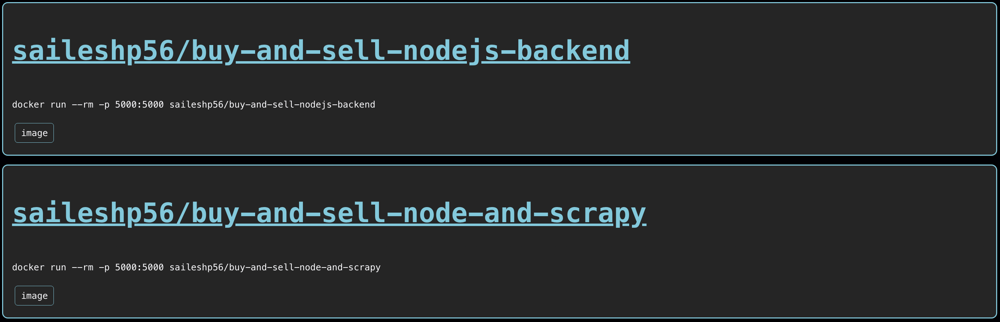

# docker-repositories-component
A React component and accompanying nginx file and Dockerfile to act as a reverse proxy to bypass CORS error from https://hub.docker.com/ where we get repository information from.

In nginx/default.conf you must replace this line:
```
proxy_pass https://hub.docker.com/v2/repositories/saileshp56/;
```
With your own username to be like this:
```
proxy_pass https://hub.docker.com/v2/repositories/<user>/;
```


Then, run this command in the root folder: 
```
docker build -t nginx-reverse-proxy .

docker run -p 8080:8080 nginx-reverse-proxy
```

The resultant component will look like this:

